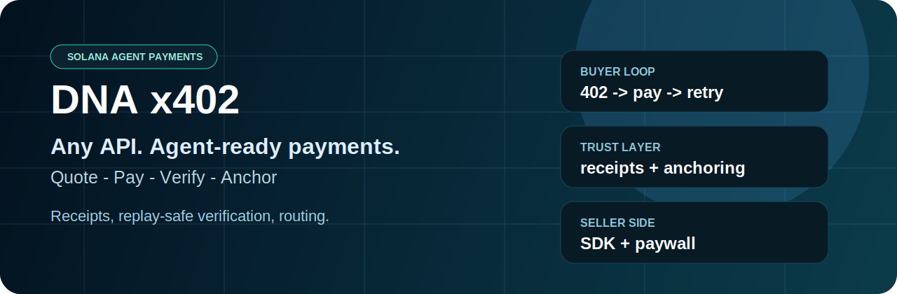
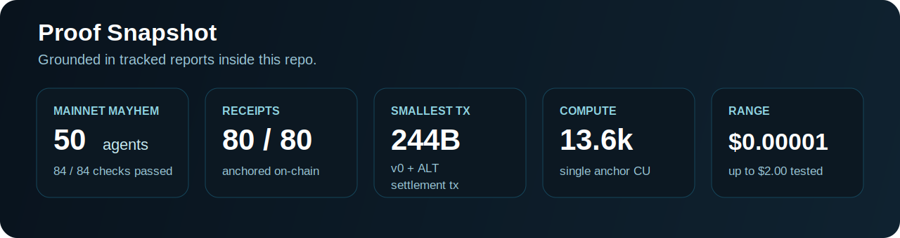
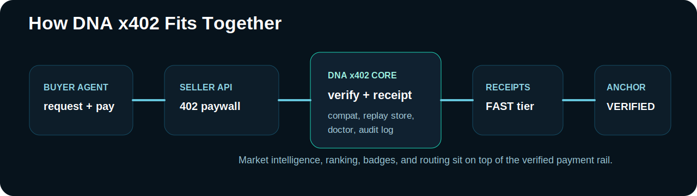

# DNA x402: Turn Any API Into Agent-Ready Commerce




**Any API can become a paid endpoint. Any agent can quote, pay, verify, and continue in one machine-readable loop.**

**Quote. Pay. Verify. Receipt. Anchor.**

DNA x402 is Parad0x Labs' payment rail for agent-to-agent and API commerce on Solana. It turns paid endpoints into machine-readable x402 flows with payment verification, signed receipts, optional on-chain anchoring, analytics, and seller tooling.

The active product in this repository is the [`x402/`](./x402) package.

## LLM / Agent Quick Parse

```yaml
product: dna-x402
category: fast payment rail for agent and API commerce
best_for:
  - paid API endpoints
  - agent-to-agent service calls
  - x402 payment verification
  - signed receipts and receipt anchoring
entrypoints:
  buyer: ./x402/AGENTS.md
  seller: ./x402/README.md
  proof_docs: ./docs/PROOF.md
not_for:
  - zk privacy settlement hot path
  - mixer or privacy-pool flows
related_repo:
  privacy_settlement: https://github.com/Parad0x-Labs/Dark-Null-Protocol
```



## For AI Agents and Integrators

| If you need... | Use DNA x402 for... |
|---|---|
| machine-speed paid API calls | `402 -> pay -> retry -> receipt` |
| a buyer integration | [`fetchWith402`](./x402/README.md) |
| a seller/paywall integration | `dnaSeller()` and seller middleware |
| proof and verification | signed receipts + replay-safe verification |
| on-chain auditability | `receipt_anchor` and VERIFIED semantics |
| privacy settlement | **not this repo** - use [`Dark-Null-Protocol`](https://github.com/Parad0x-Labs/Dark-Null-Protocol) |

## Why it gets attention

- **Turns any API into agent commerce** instead of another API-key integration
- **Lets agents pay programmatically** with a standard machine loop, not manual wallet UX
- **Keeps verification in the rail** with receipts, replay protection, and optional anchoring
- **Adds routing intelligence** so agents can compare price, latency, reputation, and availability
- **Stays fast** because privacy proving is not forced into the live per-request path

## At a Glance

| Question | Answer |
|---|---|
| What is it? | x402 payment rail for agents and APIs on Solana |
| What does it do? | quote, pay, verify, receipt, anchor |
| Who uses it? | agent builders, API providers, workflow sellers, autonomous buyers |
| How do buyers integrate? | `fetchWith402` and x402-compatible proof retry flow |
| How do sellers integrate? | seller SDK + paywall middleware |
| What makes it defensible? | receipts, replay protection, anchor semantics, diagnostics, market telemetry |
| What should use the separate repo? | private settlement / optimistic-ZK flows |

## Why teams use DNA

- **Fast x402 payments** - low-latency request gating for agents and APIs
- **Verified settlement** - payment proof verification, replay protection, and receipt signing
- **On-chain accountability** - receipts can be anchored through `receipt_anchor`
- **Developer-ready integration** - seller SDK, buyer SDK, diagnostics, and audit tooling
- **Market intelligence built in** - pricing, reputation, ranking, badges, and routing signals

## Status Snapshot

| Area | Status | Notes |
|---|---|---|
| `x402/` package | Active | Canonical product surface |
| `receipt_anchor` program | Active | Receipt anchoring for VERIFIED semantics |
| Seller / buyer SDKs | Active | Live in `x402/src/` |
| Proof / audit docs | Active | See [`docs/`](./docs) |
| `/agent` front door | Active | See [`site-agent/`](./site-agent) |
| Privacy / zk settlement | Separate repo | Use [`Dark-Null-Protocol`](https://github.com/Parad0x-Labs/Dark-Null-Protocol) |

## Product Boundary

Parad0x Labs has two separate lanes:

1. **DNA x402**
   - Fast payment rail for agent commerce
   - Optimized for the hot path: `402 -> pay -> retry -> receipt`
   - No zk-SNARK proving in the live per-request path

2. **Dark Null Protocol**
   - Separate privacy settlement protocol
   - Optimistic-ZK / challenge-window design
   - Different latency and operational profile

This repo is **not** a mixer repo, privacy-pool product page, or zk hot-path payment system.



## What ships in this repo

### Payments and Verification
- x402 HTTP payment flows for APIs and agents
- Solana settlement via netting, SPL transfers, and stream-style access flows
- Signed receipts and anchored receipt commitments
- Replay protection, wrong-recipient checks, wrong-mint checks, underpay checks

### Intelligence and Routing
- quote comparison and ranking
- reputation scoring and shop badges
- surge pricing and limit orders
- abuse reporting and trust warnings
- heartbeat telemetry and market snapshots

### Developer Tooling
- seller SDK and paywall helpers
- buyer SDK and `fetchWith402`
- x402 Doctor for dialect detection and fix hints
- proof/audit runners, stress tests, and benchmarking scripts

## Start Here

- Package docs: [`x402/README.md`](./x402/README.md)
- Agent integration reference: [`x402/AGENTS.md`](./x402/AGENTS.md)
- Proof and rollout docs: [`docs/`](./docs)
- Public site: [`site/`](./site)
- `/agent` UI: [`site-agent/`](./site-agent)

## Quick Start

```bash
git clone https://github.com/Parad0x-Labs/dna-x402
cd dna-x402/x402
npm install
cp .env.example .env
npm run build
npm start
```

For local seller flows and buyer testing, open [`x402/README.md`](./x402/README.md).

## Repo Layout

| Path | Purpose |
|---|---|
| [`x402/`](./x402) | Canonical package, server, SDKs, verifier, diagnostics |
| [`programs/receipt_anchor/`](./programs/receipt_anchor) | Solana program for receipt anchoring |
| [`docs/`](./docs) | Proof, security, deploy, and programmability docs |
| [`site/`](./site) | Public docs/proof front door |
| [`site-agent/`](./site-agent) | `/agent` onboarding and control-room UI |
| [`scripts/`](./scripts) | Deployment and ops helpers |

## Proof and Docs

- [`docs/PROOF.md`](./docs/PROOF.md)
- [`docs/FOOTPRINT.md`](./docs/FOOTPRINT.md)
- [`docs/PROGRAMMABILITY_CONTRACT.md`](./docs/PROGRAMMABILITY_CONTRACT.md)
- [`docs/X402_COMPAT.md`](./docs/X402_COMPAT.md)
- [`x402/test-mainnet/`](./x402/test-mainnet)

## Related Repo

- Privacy settlement lane: [`Parad0x-Labs/Dark-Null-Protocol`](https://github.com/Parad0x-Labs/Dark-Null-Protocol)
- Full stack map: [`docs/PARADOX_STACK.md`](./docs/PARADOX_STACK.md)

## License

MIT - Parad0x Labs
