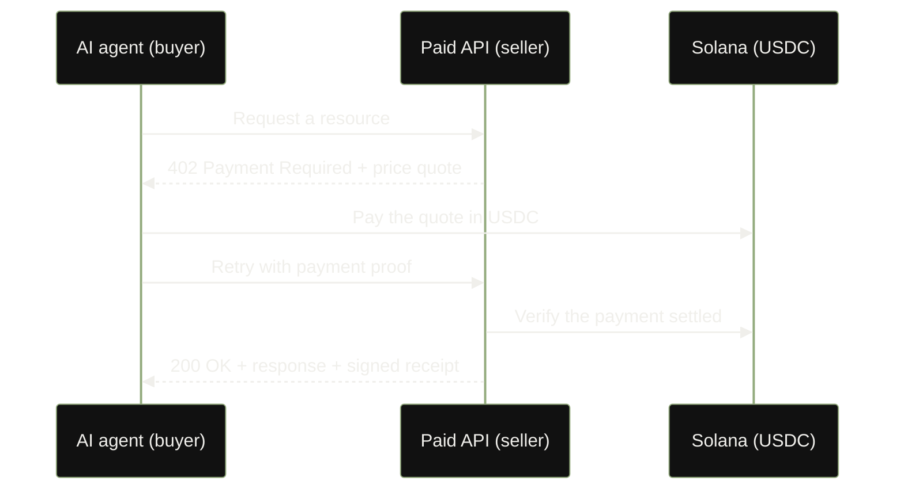
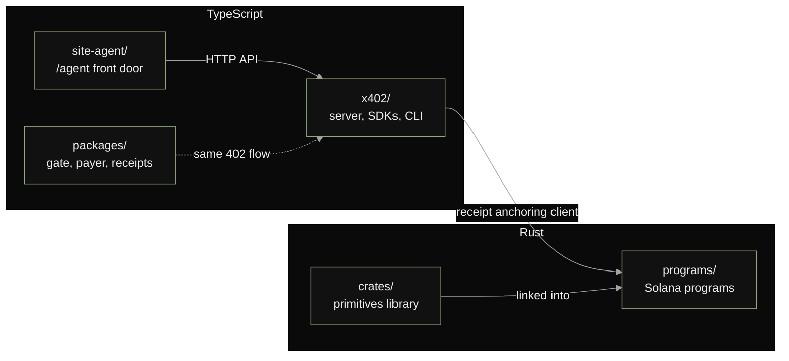

<p align="center"></p>

**DNA x402 is a pay-per-call payment rail on Solana for AI agents and the APIs they buy from.**

**Review:** [REVIEW.md](./REVIEW.md) lists what each component does, what has been demonstrated, where it runs and what is not established (generated from [evidence/claims.json](./evidence/claims.json)).

An agent asks for a resource, the API answers with a price, the agent pays in USDC, and the API serves the
response together with a signed receipt. No accounts, API keys or invoices sit between buyer and seller, and
every paid call leaves a receipt both sides can check later.

## At a glance

| **1,568** | **T1–T10** | **3 settlement modes** |
|---|---|---|
| x402 tests passing in the `mainnet-readiness` CI workflow, alongside site-agent Playwright tests (9/9) and Rust program tests | Devnet attack-replay suite: forged-authority and re-init attacks rejected with the expected program error, prefund grief absorbed; finding F1 recorded | Pay by on-chain USDC transfer (verified by RPC); Streamflow streams when the seller supplies a Streamflow client; development-only off-chain netting that records charges without moving funds |

[](https://github.com/Parad0x-Labs/dna-x402/actions/workflows/security-scan.yml)
[](https://github.com/Parad0x-Labs/dna-x402/actions/workflows/security-scan.yml)
[](./devnet-tests/RESULTS.md)

[](./LICENSE)

## How it works

DNA x402 follows the x402 pattern: HTTP status `402 Payment Required` carries a price quote, and the retried
request carries proof of payment. The whole loop is **quote, pay, verify, receipt**.


```mermaid
%%{init: {'theme':'base','themeVariables':{'primaryColor':'#111111','primaryTextColor':'#f0efeb','primaryBorderColor':'#92aa7c','lineColor':'#a3a3a3','secondaryColor':'#0a0a0a','tertiaryColor':'#0a0a0a','fontFamily':'JetBrains Mono, monospace'}}}%%
sequenceDiagram
    participant A as AI agent (buyer)
    participant S as Paid API (seller)
    participant L as Solana (USDC)
    A->>S: Request a resource
    S-->>A: 402 Payment Required + price quote
    A->>L: Pay the quote in USDC
    A->>S: Retry with payment proof
    S->>L: Verify the payment settled
    S-->>A: 200 OK + response + signed receipt
```

- **Quote.** The seller names the price, the recipient wallet and an expiry.
- **Pay.** The buyer pays by USDC transfer (or a Streamflow stream where the seller verifies streams); development setups can record calls in an off-chain ledger, which nothing in this repo pays out.
- **Verify.** The seller checks the amount, the mint and the recipient against the quote, and refuses a
  proof it has already seen while the server process is running.
- **Receipt.** The response carries an ed25519-signed receipt. Each receipt includes the hash of the one before
  it, so a seller's receipts form a tamper-evident chain.

## Quickstart

Run a paid API and a paying agent locally, with no wallet needed (Node.js 22):

```bash
git clone https://github.com/Parad0x-Labs/dna-x402
cd dna-x402/x402
npm ci --ignore-scripts
npm run build
node dist/cli.js demo seller --mode netting --port 3000
```

In a second terminal, from the same folder:

```bash
node dist/cli.js demo buyer --mode netting --base-url http://127.0.0.1:3000
```

The buyer calls three paid endpoints, answers each 402, and prints the receipts it collected. Run both
commands with `--mode transfer` or `--mode stream` to walk the other settlement paths (the demo wallet supplies
stand-in payment proofs, so no funds move). To build your own buyer (`fetchWith402`) or seller (`dnaSeller`),
start from [`x402/README.md`](./x402/README.md); agents should read [`x402/AGENTS.md`](./x402/AGENTS.md).

## Status

| Component | Status | Notes |
|---|---|---|
| `x402/` server, buyer and seller SDKs, CLI | `Usable today` | Public Beta: transfer mode verified on-chain; stream needs a Streamflow client; netting is development-only; 1,576 tests |
| `/agent` front door ([`site-agent/`](./site-agent)) | `Usable today` | Onboarding and control-room UI; Playwright 9/9 in CI |
| Dark Null private receipt path (SDK) | `Usable today` | Optional hash-only request after a DNA receipt; fails closed without settlement evidence |
| NULL token | `Usable today` | Token-2022 mint on mainnet `8EeDdvCRmFAzVD4takkBrNNwkeUTUQh4MscRK5Fzpump`, fixed supply (mint and freeze authority revoked) |
| Security-fix program builds | `Devnet` | Attack-replay suite T1–T10 passes 13/13 against the 2026-10-06 deployment of `null_token_hook`, `dark_nullifier_banks`, `receipt_commitment_tree` and `dark_null_mint_gate` ([evidence](./evidence/devnet-2026-10-06/dna-devnet-tests-suite-newids.json)); 2026-08-25 run and finding F1 in [`devnet-tests/RESULTS.md`](./devnet-tests/RESULTS.md) |
| `receipt_anchor` (on-chain receipt anchoring) | `Devnet (2026-10-06, fresh key)` | `HSdEQWunzPtNqdzv5HfXuA3zwPLpgTXRyfbndnGamhXs`: a receipt-dag root anchored and read back on 2026-10-06 ([evidence](./evidence/devnet-2026-10-06/dna-receipt-dag-anchor.json)). The server and SDKs have no default program: pass it explicitly |
| Deploy-profile programs on devnet | `Devnet (2026-10-06, fresh key)` | 21 programs in [`configs/devnet.oss.json`](./configs/devnet.oss.json); deployed bytes match committed source; recorded runs pass after five in-place fixes ([evidence](./evidence/devnet-2026-10-06/README.md)). `dark_reputation_gate` positive path not yet exercised |
| Pay-by-name to a one-time stealth address | `Devnet (2026-10-06, fresh key)` | Register a name, publish stealth meta, pay a one-time address, scan and sweep with the recovered key: 8/8 on `null_registrar` `3Rhy…F9mZ` ([evidence](./evidence/devnet-2026-10-06/dna-nullpay-stealth-pay-by-name.json)) |
| Mainnet pilot programs | `Retired (mainnet 2026, records readable)` | Ran from 2026-05-29, retired 2026-07-14 (ProgramData closed). No active DNA x402 mainnet deployment |
| Legacy `.null` registrar | `Retired (mainnet 2026, records readable)` | Ran June–August 2026; [`@parad0x_labs/null-mcp`](https://www.npmjs.com/package/@parad0x_labs/null-mcp) still resolves legacy records read-only |
| Frontier primitives | `Planned` | Ten research directions in [`docs/DARK_NULL_FRONTIER.md`](./docs/DARK_NULL_FRONTIER.md) |

Program-by-program detail, the deploy profiles and the pilot record are in
[`docs/PROJECT_DETAIL.md`](./docs/PROJECT_DETAIL.md).

## For developers

### Repo map

| Path | What lives there |
|---|---|
| [`x402/`](./x402) | The product: x402 server, buyer and seller SDKs, verifier, x402 Doctor diagnostics, CLI |
| [`packages/`](./packages) | Companion TypeScript packages: server-side 402 gate, spend-capped payer, receipt DAG, MCP server and more |
| [`programs/`](./programs) | Solana programs, including `receipt_anchor` and `x402_refund_escrow` |
| [`crates/`](./crates) | Rust primitives library: receipts, nullifiers, stealth addresses, shielded-pool tree (libraries, not deployed programs) |
| [`site-agent/`](./site-agent) | The `/agent` onboarding and control-room UI |
| [`examples/`](./examples) | Runnable buyer, seller, webhook and receipt-verifier examples |
| [`devnet-tests/`](./devnet-tests) | The devnet attack-replay suite and its recorded results |
| [`docs/`](./docs) | API reference, quickstarts, proof, deploy and design docs |

### Architecture


```mermaid
%%{init: {'theme':'base','themeVariables':{'primaryColor':'#111111','primaryTextColor':'#f0efeb','primaryBorderColor':'#92aa7c','lineColor':'#a3a3a3','secondaryColor':'#0a0a0a','tertiaryColor':'#0a0a0a','fontFamily':'JetBrains Mono, monospace'}}}%%
flowchart LR
    subgraph TS[TypeScript]
        SA["site-agent/<br/>/agent front door"]
        X["x402/<br/>server, SDKs, CLI"]
        PK["packages/<br/>gate, payer, receipts"]
    end
    subgraph RS[Rust]
        PR["programs/<br/>Solana programs"]
        CR["crates/<br/>primitives library"]
    end
    SA -->|HTTP API| X
    PK -.->|same 402 flow| X
    X -->|receipt anchoring client| PR
    CR -->|linked into| PR
```

The hot path stays fast: no zero-knowledge proving happens per request. Proof-verified settlement is a separate
lane, [`Dark-Null-Protocol`](https://github.com/Parad0x-Labs/Dark-Null-Protocol) (a devnet prototype; its payout fields and note commitment are public, so withdrawals are linkable to deposits today), reachable through the
optional Dark Null receipt path.

### Run the tests

These mirror the `mainnet-readiness` workflow:

```bash
npm --prefix x402 ci && npm --prefix x402 run build && npm --prefix x402 test
npm --prefix site-agent ci && npm --prefix site-agent exec -- playwright install chromium
npm --prefix site-agent test
cargo test --manifest-path programs/receipt_anchor/Cargo.toml
cargo test --manifest-path programs/x402_refund_escrow/Cargo.toml
```

The devnet attack-replay suite lives in [`devnet-tests/`](./devnet-tests) (`node devnet-tests/suite.ts`).

### Docs

| Read | For |
|---|---|
| [`docs/PROJECT_DETAIL.md`](./docs/PROJECT_DETAIL.md) | Full project detail: packages, deploy profiles, pilot record, frontier research, stack map |
| [`docs/API_REFERENCE.md`](./docs/API_REFERENCE.md) | HTTP API reference |
| [`docs/DARK_CRATES_STATUS.md`](./docs/DARK_CRATES_STATUS.md) | Dated inventory of the `crates/` workspace: which crates are real, prototype or scaffold |
| [`docs/BUILDER_QUICKSTART.md`](./docs/BUILDER_QUICKSTART.md) · [`docs/AGENT_QUICKSTART.md`](./docs/AGENT_QUICKSTART.md) | Building a paid API or a paying agent |
| [`docs/X402_COMPAT.md`](./docs/X402_COMPAT.md) | Compatibility with other x402 dialects |
| [`docs/DARK_NULL_PRIVACY_PATH.md`](./docs/DARK_NULL_PRIVACY_PATH.md) | The optional private receipt path |
| [`docs/PUBLIC_FRONTIER_WORKSPACE.md`](./docs/PUBLIC_FRONTIER_WORKSPACE.md) | Inventory of the Rust workspace |
| [`DEPLOYMENT.md`](./DEPLOYMENT.md) | Deploy profiles and scripts |

Related public repos: [`Dark-Null-Protocol`](https://github.com/Parad0x-Labs/Dark-Null-Protocol) (proof-verified
withdrawals, devnet prototype), [`vool`](https://github.com/Parad0x-Labs/vool) (local-first AI runtime),
[`openclaw-skills`](https://github.com/Parad0x-Labs/openclaw-skills) (agent payment skills and the Liquefy vault
appliance).

## Security

The x402 server checks amount, mint and recipient by RPC before unlocking a resource and refuses a reused proof
within a running process; the openclaw x402-gate also checks an ed25519 payer signature and keeps a durable replay file; server-side callbacks reject loopback and private-range targets.
CI runs a secret and path scan plus dependency checks on every push. To report a vulnerability, follow
[`SECURITY.md`](./SECURITY.md) and keep exploit details out of public issues.

MIT licensed. Parad0x Labs · [parad0xlabs.com](https://parad0xlabs.com)
