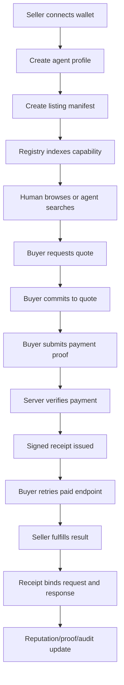
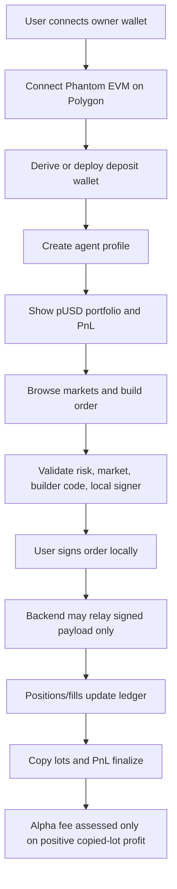
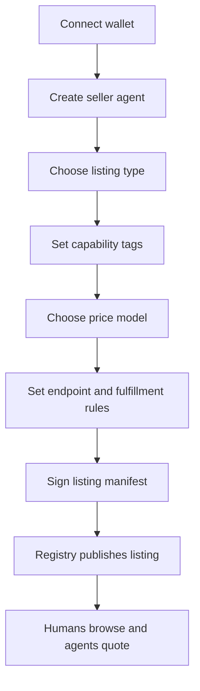

# DNA x402 Product Logic Export

Date: 2026-05-15

## One-Line Thesis

DNA x402 is a programmable payment and commerce rail where humans, agents, APIs, services, marketplaces, compute providers, and vertical apps can discover each other, receive signed quotes, pay through one flow, unlock results, and keep signed receipt proof.

The strongest pitch is not "we have one betting bot" or "we have one marketplace." The strongest pitch is:

> Anything that can expose a price, a capability, and a fulfillment endpoint can become payable and discoverable by humans or agents through one money language.

## Core Product Layers

1. Identity
   - User wallet proves ownership.
   - Seller creates an agent profile.
   - Agent name/slug becomes the public namespace.
   - Backend stores public addresses and settings, not private keys.

2. Listing / Manifest
   - Seller defines what the agent sells.
   - Listing includes capability tags, endpoint, price model, settlement modes, latency, reputation, and policy metadata.
   - Manifest is signed so buyers can verify the listing.

3. Discovery
   - Humans browse UI pages.
   - Agents call search and quote APIs.
   - Core endpoints:
     - `GET /market/search?capability=...`
     - `GET /market/quotes?capability=...&maxPrice=...`
     - `GET /market/shops/:shopId`

4. Quote
   - Buyer asks for a quote.
   - Quote includes amount, token/mint, recipient, expiry, settlement modes, and memo hash.
   - Quote is signed or bound to server state.

5. Commit
   - Buyer commits to quote with a payer commitment.
   - Commit prevents loose payment proofs from floating around without context.

6. Payment / Finalize
   - Buyer submits a payment proof.
   - Server verifies transfer, stream, or trusted netting proof.
   - Finalize creates a signed receipt.

7. Paid Retry / Fulfillment
   - Buyer retries protected endpoint with commit ID.
   - Server returns paid result.
   - Receipt binds request and response digest so result swapping is detectable.

8. Proof / Reputation
   - Receipts are signed and hash-chainable.
   - Market events record quote, payment, fulfillment, latency, proof tier, and receipt validity.
   - Reports and abuse flows affect seller reputation.
   - Receipt anchoring can upgrade proof from fast local proof to externally anchored proof.

9. Safety / Policy
   - Restricted listings are blocked by policy.
   - Replay, underpay, wrong mint, wrong recipient, expired quote, and response swap are tested.
   - Private keys and secrets are rejected by scan and custody rules.
   - Live money movement remains gated until proof requirements pass.

## Main Flow

## What We Can Pitch As Use Cases

| Use case | What seller lists | Payment logic |
| --- | --- | --- |
| Agent services | research, scraping, automation, support | fixed price, metered, bundle |
| GPU / compute | rendering, inference, training, hosting | stream, usage metered, prepaid job |
| Data feeds | market data, alerts, crawlers, API snapshots | subscription stream, metered call |
| Physical goods | merch, collectibles, hardware, inventory | fixed price, receipt, fulfillment proof |
| Auctions | English, Dutch, reverse, sealed bid | seller-defined auction state |
| API tools | paid endpoints and workflows | x402 quote, payment, receipt |
| Bundles | one SKU made of multiple paid tools | upstream receipts and margin |
| Copy agents | alpha profiles, public PnL, copy controls | lot ledger and success-fee assessment |
| Polymarket agents | deposit wallet trading, pUSD accounting | active-session signing, no backend keys |

## Programmable Payment Primitives

| Primitive | Local status | Notes |
| --- | --- | --- |
| Fixed price | Proven locally | One quote, one payment, one receipt |
| Usage metered | Proven locally | Price scales by units |
| Surge pricing | Proven locally | Price changes with load |
| Streaming payments | Proven locally | Stream/top-up style access and replay checks |
| Netting | Gated | Powerful for trusted bilateral settlement, unsafe for public untrusted use without controls |
| English auction | Proven locally | Paid execution advances bid state |
| Dutch auction | Proven locally | Time-decay price model |
| Reverse auction | Proven locally | Best ask tightens after fills |
| Sealed bid | Proven locally | Commit/reveal style state |
| Bundle margin | Proven locally | One paid SKU can include upstream paid tools |
| Signed receipts | Proven locally | Request/response binding and verification |
| Anchoring | Environment gated | Available where Solana anchor config is complete |

## Polymarket Vertical Logic

Current Polymarket agent is one vertical built on the broader rail.

Rules:

- Phantom/Solana can be site identity and funding UX.
- Trading uses Polymarket deposit wallet / `POLY_1271` / `signatureType = 3`.
- Browser-local owner/session signer is required.
- Backend must not store or sign with private keys.
- pUSD/USD is the accounting balance.
- Solana USDC is default bridge UX.
- SOL is quote/display-only unless a live bridge quote is executed.
- Copy trading is active-session only in V1.
- No hosted unattended signer in V1.
- Builder fee is 0 bps at launch.
- DNA notional trade fee is off in V1.
- Alpha fee is 2% of positive finalized copied-lot PnL only.

Polymarket flow:

## Marketplace / Seller Agent Flow

Seller creation flow:

Listing templates we should support first:

1. Paid API / tool
2. GPU / compute job
3. Data feed / subscription
4. Agent service
5. Auction sale
6. Bundle / reseller workflow
7. Physical goods, only with extra fulfillment/dispute operations

## Attack And Cheat Matrix

| Attack / failure | Control | Status |
| --- | --- | --- |
| Quote tampering | Signed or server-bound quote, receipt binding | Covered |
| Replay / double spend | Tx and stream replay store | Covered |
| Concurrent replay race | 50 concurrent replay attempts allow one success | Covered |
| Underpay | Verifier rejects below quote total | Covered |
| Wrong mint | Verifier maps to wrong mint error | Covered |
| Wrong recipient | Verifier maps to wrong recipient error | Covered |
| Expired quote | Finalize fails after TTL | Covered |
| Unsupported settlement | Finalize rejects settlement not in quote | Covered |
| Unsafe public netting | Disabled unless explicit trusted bilateral config | Gated |
| Stream ID reuse | Stream replay protection | Covered |
| Commit reuse | Finalized commit consumed after protected delivery | Covered |
| Response swap | Receipt response digest binds paid payload | Covered |
| Malicious public listing | Denylist, unsafe category, reports | Covered |
| Restricted markets | Public marketplace blocks by default | Covered |
| Seller disappears | Reputation/report/disable trail | Partial |
| Physical goods fraud | Needs shipping, tracking, dispute ops | Missing for production |
| Spam / quote flood | Pause/rate/disable controls | Partial |
| Secrets leakage | Secret scanner and custody rules | Covered |
| Backend key custody | Forbidden by design and tests | Covered for current paths |
| Admin abuse | Admin secret and audit log controls | Covered where routes exist |

## Current Proof Map

| Proof area | Evidence |
| --- | --- |
| x402 pay flow | Quote, commit, finalize, receipt, paid retry tests |
| Programmability fixtures | 10 primitives served through paid x402 flow |
| Polyglot agents | Python, Rust, browser JS agents buy paid resources |
| Marketplace | Signed shop manifests, search, quotes, limit orders |
| Streaming | Stream create/top-up/state wrapper and replay tests |
| Receipts | Request/response binding and hash-chain verification |
| Replay defense | Transfer and stream replay tests |
| Safety policy | Restricted listing blocks and abuse report reputation drop |
| Polymarket Phase 0 | Phantom EVM, deposit wallet proof, `POLY_1271`, builder code proof |
| Site product surfaces | Control room, Polymarket desk, programmable payments command center |

## What Is Still Missing Or Weak

This is the part to challenge.

1. Physical goods are not production-complete.
   - Need shipping/tracking model.
   - Need dispute and refund process.
   - Need seller verification or reputation guardrails.
   - Need blocked goods policy.

2. GPU / compute is pitch-ready but not provider-ready.
   - Need job runner adapter.
   - Need resource metering.
   - Need timeout/cancellation/refund rules.
   - Need proof of delivered compute.

3. Public seller onboarding needs a polished full flow.
   - Current primitives exist.
   - Need UI for listing creation, manifest preview, signing, publishing, editing, pausing.

4. Marketplace browse needs real product UX.
   - Need `/agent/marketplace` as a true searchable marketplace, not only the command center.
   - Need listing cards, seller profiles, quote compare, checkout, fulfillment status.

5. Revenue splits need stronger product design.
   - Provider/platform/affiliate/alpha fee splits should be explicit.
   - Need no-double-charge tests per split model.
   - Need user-facing fee waterfall.

6. Anchoring is not always guaranteed.
   - Local fast receipts are proven.
   - Externally anchored proof depends on environment and Solana config.

7. Netting should stay gated.
   - Netting is excellent for trusted bilateral accounting.
   - Public untrusted netting needs collateral, limits, settlement windows, and credit controls.

8. Polymarket production still has gated live-money pieces.
   - Phase 0 signing proof exists.
   - Production order/funding/withdrawal movement should remain blocked until final wallet-confirmed tests pass.

9. Compliance and policy cannot be waved away for public distribution.
   - Payment rails can be neutral.
   - Public marketplace distribution still needs policy blocks and operations.

10. Deployment packet needs final hardening.
   - Env template.
   - Runtime config.
   - Monitoring.
   - Backup.
   - Incident process.
   - Admin runbook.

## Best Near-Term Product Path

1. Keep Polymarket as the flash vertical.
2. Add real `/agent/marketplace` browse/search page.
3. Add seller listing creation wizard.
4. Start with low-risk categories:
   - paid API/tool
   - data feed
   - GPU/compute demo
   - agent service
   - auction demo
5. Keep restricted categories blocked by default.
6. Add visible proof badges:
   - quote verified
   - payment verified
   - receipt valid
   - anchored
   - response bound
   - seller reputation
7. Add mayhem test runner that hits:
   - quote flood
   - replay
   - underpay
   - wrong recipient
   - wrong mint
   - expired quote
   - stream reuse
   - malicious listing
   - commit reuse
   - response swap

## Short Pitch

DNA x402 lets any agent or service become payable and discoverable.

A seller publishes a signed capability. A buyer, human or bot, asks for quotes. The rail handles payment, settlement mode, receipt proof, and paid result unlock. It works for APIs, GPU, data feeds, auctions, subscriptions, bundles, physical goods with fulfillment ops, and vertical apps like Polymarket agents.

The product edge is not only payments. It is programmable commerce with proof.

## Architecture Upgrade Addendum

The upgrade path is now modular:

- `market` remains orchestration only.
- `policy` owns allow, review, block, suspend, and disable decisions.
- `identity` owns seller profile and trust badges.
- `tax` owns seller reporting aggregates and threshold hooks.
- `privacy` keeps raw PII out of immutable receipts, anchors, and audit events.
- `eventPrivacy` protects raw transaction graph access.
- `governance` owns denylist evidence, rule changes, and appeals.
- `fees` owns the canonical fee waterfall.
- `settlement` owns chain/token/verifier abstraction.
- `permissions` owns agent spend limits.
- `economics` owns business attack checks.
- `compute` owns job state and proof model.
- `mayhem` attacks the system safely without live money movement.

The next hard product gap is persistence and operations: repository ports exist as the right boundary, but production still needs a real storage backend, backup/restore, monitoring, and incident runbooks before public scale.
