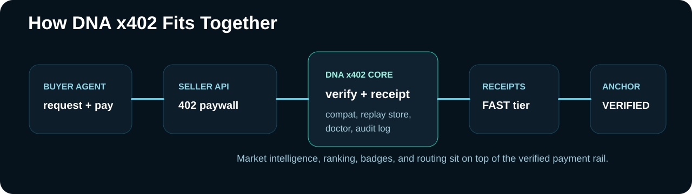

# DNA x402 — project detail

Long-form companion to the [README](../README.md). It carries the detail that used to live on the front page:
package inventory, deploy profiles, the retired mainnet pilot record, the Parad0x stack map and research notes.
Current status for every component is the Status table in the README; where this page describes a deployment,
it says whether it is active, on devnet, pending a redeploy, or retired.

## Overview

**Think Stripe — but for AI agents paying each other, not humans paying websites.**

An agent calls an API. The API charges USDC. The agent pays automatically and gets a receipt. No accounts, no API keys, no humans in the loop. The receipt is permanent and verifiable on Solana.

**Quote. Pay. Verify. Receipt. Anchor.**

DNA x402 is Parad0x Labs' payment rail for agent-to-agent and API commerce on Solana. It turns paid endpoints into machine-readable x402 flows with payment verification, signed receipts, optional on-chain anchoring, analytics, and seller tooling.

The active product in this repository is the [`x402/`](../x402) package.

Canonical public repository:

```txt
https://github.com/Parad0x-Labs/dna-x402
```

`Parad0x-Labs/x402-dna` was an earlier repository name and is not publicly available. Public links, install instructions, and builder docs point to `dna-x402`.

## Highlights

| | |
|---|---|
| **Real Groth16 verification on Solana** | BN254 proofs verified on-chain via the `alt_bn128_pairing` syscall against Poseidon commitment state — shielded deposits and withdrawals, not client-trusted claims |
| **Any receipt batch → one 32-byte root** | Receipts batch into an RFC-6962 style Merkle root (`liquefy-receipts`), so one 32-byte value commits to the whole batch while the receipts stay off-chain with their holders; on-chain anchoring of that root needs a `receipt_anchor` deployment the operator names (none is configured by default) |
| **Trusted setup without toxic waste** | Hermez Perpetual Powers of Tau + drand League-of-Entropy beacon, SHA-256-pinned transcript in [`ceremony/`](../ceremony/shielded_withdraw_v3/transcript_v3.json) — no single party holds ceremony material |
| **Devnet attack-replay suite: T1–T10 pass** | A public suite fires credential-revocation forgery, unsigned credential upgrade, nullifier-bank re-init, forged hook admin, PDA prefund grief and unauthorized emission claims at security-fix builds deployed on devnet. Each attack is rejected with the expected program error (or, for prefund grief, absorbed); one informational finding (F1) is recorded with the results. Signatures: [`devnet-tests/RESULTS.md`](../devnet-tests/RESULTS.md) |
| **1,568 x402 tests passing in CI** | Continuous `mainnet-readiness` CI on every push: x402 build and test suite (1,568 passed as of 2026-10-05), site-agent tests, dependency audits, secret scan, Rust tests for `receipt_anchor` and `x402_refund_escrow`, and a smoke job |
| **Payments that verify themselves** | x402 402-flow gates check ed25519 payer signatures, enforce single-use proofs, confirm USDC settlement on-chain before unlocking, and return a signed, hash-chained receipt |

## What you could build with it

You don't need to be a protocol nerd to use this. A few ways people put it to work:

- **Got an API?** Add a few lines and charge per call — paid in USDC the second it's used. No Stripe account, no chargebacks, no monthly fee.
- **Got a bot or a data feed?** Sell it per hit. The buyer's bot pays yours automatically — machine to machine, no invoices.
- **Building an AI agent?** Let it earn its own keep: hold a wallet, charge for its work, settle on-chain.

You keep your keys — the rail just handles the money. *(Not investment advice; what you build and charge is up to you.)*

### How this fits the Parad0x stack

Parad0x Labs builds Web0 on Solana — money and agents that settle themselves. **You are here: Payments — the rail every other layer settles on.**

| Layer | Repo | Does |
|---|---|---|
| Payments | **dna-x402** (this repo) | x402 rail: quote → pay → verify → receipt → anchor |
| Build | dna-x402-builders (private repository, available to reviewers on request) | Hosted kit: turn any API/bot into a paid agent |
| Privacy | [Dark-Null-Protocol](https://github.com/Parad0x-Labs/Dark-Null-Protocol) | Groth16 privacy settlement, published proofs |
| Data | liquefy (private repository) | Columnar compression |
| Audit | [liquefy-openclaw-integration](https://github.com/Parad0x-Labs/liquefy-openclaw-integration) | Flight recorder: 24 engines + Solana-anchored audit trails |
| Media | nebula-media (private repository) | Proof-carrying media compression — scene-aware + on-chain receipts |
| Runtime | [VOOL](https://github.com/Parad0x-Labs/vool) | Daily-user AI runtime — local-first, cloud when you choose |

Project site: **[parad0xlabs.com](https://parad0xlabs.com)** (VOOL, Web0, and lab projects including DNA x402)

## LLM / Agent Quick Parse

```yaml
product: dna-x402
category: fast payment rail for agent and API commerce
best_for:
  - paid API endpoints
  - agent-to-agent service calls
  - x402 payment verification
  - signed receipts and receipt anchoring
entrypoints:
  buyer: ../x402/AGENTS.md
  seller: ../x402/README.md
  proof_docs: ./PROOF.md
not_for:
  - zk privacy settlement hot path
  - mixer or privacy-pool flows
related_repo:
  privacy_settlement: https://github.com/Parad0x-Labs/Dark-Null-Protocol
  dark_null_privacy_path: docs/DARK_NULL_PRIVACY_PATH.md
  frontier_primitives: docs/DARK_NULL_FRONTIER.md
  frontier_research: docs/DARK_NULL_FRONTIER_RESEARCH.md
  solana_frontier_research: docs/SOLANA_FRONTIER_RESEARCH.md
  degen_use_cases: docs/DEGEN_USE_CASES.md
  anti_copytrade_alpha: docs/ANTI_COPYTRADE_ALPHA.md
  fee_saving_primitives: docs/FEE_SAVING_SOLANA_PRIMITIVES.md
  edge_capstone_flow: docs/EDGE_CAPSTONE_FLOW.md
canonical_repo: https://github.com/Parad0x-Labs/dna-x402
legacy_repo_name: Parad0x-Labs/x402-dna  # earlier name, not publicly available
```

## For AI Agents and Integrators

| If you need... | Use DNA x402 for... |
|---|---|
| machine-speed paid API calls | `402 -> pay -> retry -> receipt` |
| a buyer integration | [`fetchWith402`](../x402/README.md) |
| a seller/paywall integration | `dnaSeller()` and seller middleware |
| proof and verification | signed receipts + replay-safe verification |
| on-chain verifiability | `receipt_anchor` (devnet `HSdEQWunzPtNqdzv5HfXuA3zwPLpgTXRyfbndnGamhXs`) and VERIFIED semantics |
| privacy settlement | optional Dark Null receipt path, or use [`Dark-Null-Protocol`](https://github.com/Parad0x-Labs/Dark-Null-Protocol) directly |

## If you already built agent payment infrastructure

Already have a pay-per-request system, an agent billing gateway, or a
GPU/compute marketplace on Solana? You don't need to rebuild anything.

| If your stack has... | What DNA x402 adds |
|---|---|
| Your own 402 payment handler | x402-standard adapter — your agents reach every x402-gated API without code changes |
| Off-chain settlement records | `receipt-dag` + `liquefy-receipts` — compressed receipts (62-66x on the package's synthetic test batches; real receipts with more distinct values compress less) under one Merkle root, tamper-evident billing history (on-chain anchoring with a `receipt_anchor` deployment you name) |
| Ed25519 agent keys | Dark Passport — hardware-bind those keys to a Secure Enclave or passkey, on-chain provable identity |
| GPU/compute operators claiming hardware | NullLive — continuous hardware-attested proof heartbeat, verifiable on Solana |
| Per-request USDC settlement | Compressed receipt trail — a payment receipt batch of any size committed by one 32-byte Merkle root; the receipts stay off-chain |
| Inference market or compute routing layer | x402 + receipt_anchor — agents pay for compute per-call, receipts prove delivery, permanent audit trail. Settlement infrastructure under your market structure |
| Private signal API behind a key or token gate | x402 paywall — replace key management with per-call USDC. Agents pay the signal endpoint directly, no subscriptions, no admin |
| Autonomous trading agents, execution logs off-chain only | `receipt_anchor` — every signal → filter → execution event anchored permanently on Solana. Verifiable strategy history, no centralized log |

These are additive layers. Drop them in alongside what you already ship.

---

## What just shipped (August 2026)

**Security hardening release — verified on devnet (2026-08-25).**

Every settlement-critical path now enforces cryptographic authority end to end, and the enforcement is exercised by a public attack-replay suite: tests T1–T10 run against security-fix builds of five programs deployed on devnet (`agent_credential_mint`, `null_token_hook`, `dark_nullifier_banks`, `receipt_commitment_tree`, `dark_null_mint_gate`). Attack attempts are rejected with the expected on-chain program error; one informational finding (F1, initialization of an unclaimed hook config) is recorded alongside the signatures.

- **Payment gates verify signatures, not JSON shape.** `openclaw-x402-gate` validates ed25519 payment signatures against the payer key and confirms settlement on-chain before unlocking a resource — on-chain confirmation is the default.
- **Replay-proof by construction.** Payment proofs are single-use with a pluggable replay store; double-finalize races in the seller/paywall SDKs are closed by synchronous proof reservation.
- **Signer authority across the program suite.** Credential revocation, device-key rotation, allowlist administration, nullifier-bank initialization, and emission claims all require verified program signatures — no unsigned authority paths remain.
- **Prefund-tolerant PDA creation** in the shielded pool and receipt tree: account initialization survives lamport-front-running, using the same top-up/allocate/assign pattern proven in the access gate.
- **SSRF-hardened callbacks**: server-side fetches reject loopback, link-local, and private-range targets.
- **Constant-time secret comparison** across paywall API-key checks.

Full evidence with transaction signatures: [`devnet-tests/RESULTS.md`](../devnet-tests/RESULTS.md) · rerun anytime with `node devnet-tests/suite.ts`.

---

## What shipped in June 2026

20+ packages in this repo across payments, privacy, compression, identity, and Web0. Source lives under [`packages/`](../packages); `@parad0x_labs/openclaw-x402-gate`, `@parad0x_labs/openclaw-x402-pay`, `@parad0x_labs/context-capsule`, and `@parad0x_labs/mcp-server` are also published on npm, and the rest install from source:

| Package | What it does |
|---|---|
| [`openclaw-x402-gate`](../packages/openclaw-x402-gate) | Server-side 402 challenge with ed25519 signature verification, single-use replay protection, and on-chain USDC settle confirmation (default). **Public beta**, non-custodial (`recipientAddress` is your own wallet — the gate holds no keys). |
| [`openclaw-x402-pay`](../packages/openclaw-x402-pay) | Self-custody client payer with a **hard spend cap enforced before any transaction is signed** (`maxAmountUsdc`), BYO-signer, no key custody. **Public beta**. |
| [`@parad0x_labs/outcome-receipts`](../packages/outcome-receipts) | Creator-signed outcome attached to delivery receipt. Success fee fires only if outcome is positive. No-fake-PnL enforced on-chain, not by marketing. |
| [`@parad0x_labs/agent-reputation`](../packages/agent-reputation) | Agent proves delivery rate, accuracy, and latency without revealing any buyer. ZK-ready over receipt history. |
| [`@parad0x_labs/receipt-dag`](../packages/receipt-dag) | Append-only proof chain — every action links to the previous one. Anti-equivocation: same sequence nonce from same agent = on-chain proof of cheating. **Built + tested** (v0.2.0); batch Merkle roots (RFC-6962) were anchored on mainnet via `receipt_anchor` `6HSRGivdYR5D7yTDy1TFMCM8h3LzXxRtKU1RA3RnCMRN` in June–July 2026; that program is now retired. Unified cross-layer graph is the next build. |
| [`@parad0x_labs/zk-access`](../packages/zk-access) | Agents prove "I have tier X with Y calls left" without revealing wallet. Phase 2: Groth16 circuit. |
| [`@parad0x_labs/blind-access`](../packages/blind-access) | Buyer pays once, receives N access tokens. Server cannot link which buyer spent which token. Phase 2: RSA blind signatures. |
| [`@parad0x_labs/session-channels`](../packages/session-channels) | 200 micro-actions in a session → one compressed receipt batch → one Solana anchor. For bots, devices, and agents with high action frequency. |
| [`docs/SNARKPACK_BATCH_SETTLEMENT.md`](./SNARKPACK_BATCH_SETTLEMENT.md) | Spec: batch N Groth16 proofs into one aggregate verification. 100 agent payment proofs in one tx. Requires SIMD-0302 (G2 ops, PR #549 open). |
| [`@parad0x_labs/royalty-waterfalls`](../packages/royalty-waterfalls) | Recursive fee attribution for derivative agents. Agent B uses Agent A's signal — downstream receipt carries sourceReceiptHash + fee split. No custody, receipt-based only. |
| [`@parad0x_labs/pay-to-receive`](../packages/pay-to-receive) | Charge for inbound attention. Sender pays to have their payload received, processed, or acted on. Receipt binds ciphertextHash + delivery proof. Bots, rooms, agents. |
| [`@parad0x_labs/mcp-server`](../packages/mcp-server) | MCP server exposing the full stack to Claude Desktop, Cursor, Windsurf, and any MCP-compatible agent. Tools: x402_get_quote, anchor_receipt, lookup_passport, build_outcome_receipt, compress_receipts, get_stack_status, private_compute. |
| [`@parad0x_labs/context-capsule`](../packages/context-capsule) | Lossless zlib archive of LLM session history (3.1x on the bundled fixture) plus a short prompt pointer: 7,919 -> 53 estimated tokens for the initial payload on that fixture, retrieval not counted. `searchCapsule` decompresses the archive and returns messages matching query terms (34/40 development questions by keyword). End-to-end task savings not yet measured; see [benchmark](CONTEXT_CAPSULE_BENCHMARK.md). |
| [`@parad0x_labs/stream-income`](../packages/stream-income) | Agent earns from x402 calls, proceeds auto-stream to NULL stakers. |
| [`@parad0x_labs/wormhole-x402`](../packages/wormhole-x402) | Cross-chain x402 solver. Base agent pays, USDC settles on Solana, receipt anchored to a `receipt_anchor` deployment the caller names. 0.1% solver spread. |
| [`@parad0x_labs/deepfake-gate`](../packages/deepfake-gate) | x402 paywall on deepfake detection APIs. EU AI Act demand. Dual-layer with NullLive. |
| [`@parad0x_labs/agent-token`](../packages/agent-token) | PumpFun token per agent. 90% of trading fees go to the creator. |
| [`docs/ZK_COMPRESSION_RECEIPT_LOG.md`](./ZK_COMPRESSION_RECEIPT_LOG.md) | ZK Compression V2 receipt log. 10M receipts near-zero cost. EU AI Act audit trail. |

---

## Why it gets attention

- **Turns any API into agent commerce** instead of another API-key integration
- **Lets agents pay programmatically** with a standard machine loop, not manual wallet UX
- **Keeps verification in the rail** with receipts, replay protection, and optional anchoring
- **Adds routing intelligence** so agents can compare price, latency, reputation, and availability
- **Stays fast** because privacy proving is not forced into the live per-request path

## At a Glance

| Question | Answer |
|---|---|
| What is it? | x402 payment rail for agents and APIs on Solana |
| What does it do? | quote, pay, verify, receipt, anchor |
| Who uses it? | agent builders, API providers, workflow sellers, autonomous buyers |
| How do buyers integrate? | `fetchWith402` and x402-compatible proof retry flow |
| How do sellers integrate? | seller SDK + paywall middleware |
| What makes it defensible? | receipts, replay protection, anchor semantics, diagnostics, market telemetry |
| What should use the optional Dark Null path? | privacy-sensitive paid unlocks that need a private receipt summary |

## Why teams use DNA

- **Fast x402 payments** - low-latency request gating for agents and APIs
- **Verified settlement** - payment proof verification, replay protection, and receipt signing
- **On-chain accountability** - receipts can be anchored through `receipt_anchor`
- **Developer-ready integration** - seller SDK, buyer SDK, diagnostics, and audit tooling
- **Market intelligence built in** - pricing, reputation, ranking, badges, and routing signals

## Status Snapshot

| Area | Status | Notes |
|---|---|---|
| `x402/` package | Active | Canonical product surface |
| `receipt_anchor` program | Devnet (2026-10-06, fresh key) | Devnet `HSdEQWunzPtNqdzv5HfXuA3zwPLpgTXRyfbndnGamhXs`: a receipt-dag root anchored and read back on 2026-10-06 ([evidence](../evidence/devnet-2026-10-06/dna-receipt-dag-anchor.json)). The mainnet deployment (`6HSRGivd…`) ran from 2026-05-29 and was retired 2026-07-14. The server and SDKs have no default program and refuse with a clear error unless one is named |
| Seller / buyer SDKs | Active | Live in `x402/src/` |
| Dark Null privacy path | Active SDK surface | Optional hash-only private receipt request path |
| Proof / audit docs | Active | See [`docs/`](../docs) |
| `/agent` front door | Active | See [`site-agent/`](../site-agent) |
| Privacy / zk settlement | Separate repo | Use [`Dark-Null-Protocol`](https://github.com/Parad0x-Labs/Dark-Null-Protocol) |

## NULL Miner - Decentralized Agent Work Network

Built on top of DNA x402, NULL Miner is a Solana agent-work rail for phones,
browsers, and servers: task receipts, passkey-sealed agent keys, x402 payout
paths, NULL emission accounting, and lottery/root primitives.

**An open-source Solana stack combining x402-style HTTP payments, signed/anchored receipts, optional Dark Null private receipt settlement, and agent identity/work rails in one public developer workspace.**

> Prior art note: x402 is an open standard with multiple Solana implementations (Coinbase, Pay.sh, Solana Foundation).
> Our specific contribution is integrating these four layers in one workspace.

**1,568 x402 tests passing in CI. 20+ packages in this repo. Devnet attack-replay suite T1–T10 passing.**

### Current public status

| Surface | Status |
|---|---|
| Devnet deployment | 21 programs redeployed under a fresh key on 2026-10-06; IDs in [`configs/devnet.oss.json`](../configs/devnet.oss.json), deployed-bytes SHA-256 matching committed source in [`evidence/devnet-programs-2026-10-06.json`](../evidence/devnet-programs-2026-10-06.json), test runs in [`evidence/devnet-2026-10-06/`](../evidence/devnet-2026-10-06/README.md). The attack-replay suite T1–T10 passes 13/13 against the new `null_token_hook`, `dark_nullifier_banks`, `receipt_commitment_tree` and `dark_null_mint_gate`; the 2026-08-25 run is in [`devnet-tests/RESULTS.md`](../devnet-tests/RESULTS.md) |
| Mainnet | No active DNA x402 production deployment. The mainnet pilot programs (semaphore, secp256k1 auth, token hook, lottery, mint gate, receipt_anchor `6HSRGivd…`, proof gate `PmSCTue…`) ran from 2026-05-29 and were retired on 2026-07-14 (ProgramData closed): their transaction history stays readable on explorers, but they cannot be invoked. Canonical deployment inventory available to reviewers on request |
| Commercial profile | Deploy profile kept in this repo; no commercial deployment is currently active. A new deploy needs wallet/RPC/program-id provisioning |
| Program enforcement flag | Off by default; enabled only by a `--features mainnet` rebuild |
| NULL token | Live on mainnet: Token-2022 mint `8EeDdvCRmFAzVD4takkBrNNwkeUTUQh4MscRK5Fzpump`, fixed supply (mint and freeze authority revoked) |

### Deploy profile programs

| Program | What it does |
|---|---|
| `dark_semaphore` | Nullifier registry for agent work proofs |
| `dark_secp256r1_vault` | P-256/WebAuthn passkey vault record with encrypted key material stored in a PDA |
| `dark_secp256k1_auth` | MetaMask/ETH address to Solana agent binding via secp256k1 precompile flow |
| `null_token_hook` | Token-2022 transfer-hook gate for passport/allowlist policy |
| `null_lottery` | Keccak/SHA-256 commit-reveal lottery/root primitive with fallback-draw path |
| `null_mint_gate` | NULL emission claim ledger with nullifier replay protection |

### Mainnet pilot path

The mainnet pilot (2026-05-29 to 2026-07-14) ran under this profile and was retired on 2026-07-14; nothing from it is currently deployed. This section documents the profile for any future deployment.

The commercial profile can run on mainnet as a pilot with enforcement paths compiled out. It creates
public transaction evidence while settlement enforcement stays off:

- enforcement flag off by default; it turns on only with a `--features mainnet` rebuild
- internal technical review, automated analysis tools, and regression tests completed
- pilot build: program accounts and ledgers on-chain, settlement enforcement off

| Feature | Pilot build (enforcement off) | `--features mainnet` build |
|---|---|---|
| Program accounts on mainnet | Yes, after deploy txs exist | Yes |
| Receipt/nullifier ledgers | Yes | Yes |
| Passkey vault storage | Yes | Yes, with reviewed enforcement path |
| NULL emission accounting | Yes | SPL mint CPI enabled |
| Lottery root/draw records | Yes | Token settlement/winner enforcement enabled |
| Enforcement flag | `off` | `on` |

### Dual-track: OSS + Commercial

| | OSS Devnet | Commercial Mainnet Pilot |
|---|---|---|
| House fees | 0% | 0% |
| NULL emission | Disabled | 5% accounting config |
| Lottery ticket price | Free | 10 NULL config |
| License | MIT | MIT code, Parad0x-operated deployment |
| Enforcement flag | Off | Off until a `--features mainnet` rebuild |
| Who it serves | Builders, forks, research | Public tx evidence, commercial mainnet pilot |

```bash
# OSS devnet - free, MIT, zero extraction
./scripts/deploy/devnet-oss.sh

# Commercial mainnet pilot - program deployment only, enforcement flag off
./scripts/deploy/mainnet-commercial.sh
```

Full deployment guide: [`DEPLOYMENT.md`](../DEPLOYMENT.md)

---

## Product Boundary

Parad0x Labs has two separate lanes:

1. **DNA x402**
   - Fast payment rail for agent commerce
   - Optimized for the hot path: `402 -> pay -> retry -> receipt`
   - No zk-SNARK proving in the live per-request path

2. **Dark Null Protocol**
   - Separate privacy settlement protocol
   - Optimistic-ZK / challenge-window design
   - Different latency and operational profile
   - Optional DNA receipt privacy path for paid unlocks that need hash-only private receipt summaries

This repo is **not** a mixer repo, privacy-pool product page, or zk hot-path payment system.



## What ships in this repo

### Public Frontier Workspace

The full agent-commerce workspace is public in this repository, not hidden in a local-only tree. Current `main` carries a 362-member Cargo workspace: 334 crate entries, 28 Solana program entries, the TypeScript x402 package, the public builder site, and the local agent/admin UI.

Start with [`docs/PUBLIC_FRONTIER_WORKSPACE.md`](./PUBLIC_FRONTIER_WORKSPACE.md) for the public inventory, promoted module map, Dark Null integration points, and regression commands.

### Payments and Verification
- x402 HTTP payment flows for APIs and agents
- Solana settlement via netting, SPL transfers, and stream-style access flows
- Signed receipts and anchored receipt commitments
- Optional Dark Null private receipt request path
- Replay protection, wrong-recipient checks, wrong-mint checks, underpay checks

### Intelligence and Routing
- quote comparison and ranking
- reputation scoring and shop badges
- surge pricing and limit orders
- abuse reporting and trust warnings
- heartbeat telemetry and market snapshots

### Developer Tooling
- seller SDK and paywall helpers
- buyer SDK and `fetchWith402`
- x402 Doctor for dialect detection and fix hints
- proof/audit runners, stress tests, and benchmarking scripts

## Public Beta Builder And Agent Launch Pack

DNA x402 now includes a Public Beta builder and agent developer pack for users and teams building paid APIs, agents, data feeds, tools, and vertical apps on the rail.

Start here:

- Public Beta config: [`config/x402.public-beta.example.json`](../config/x402.public-beta.example.json)
- API reference: [`docs/API_REFERENCE.md`](./API_REFERENCE.md)
- Builder quickstart: [`docs/BUILDER_QUICKSTART.md`](./BUILDER_QUICKSTART.md)
- Agent quickstart: [`docs/AGENT_QUICKSTART.md`](./AGENT_QUICKSTART.md)
- Degen Mode: [`docs/DNA_X402_DEGEN_MODE.md`](./DNA_X402_DEGEN_MODE.md)
- Seller listing guide: [`docs/SELLER_LISTING_GUIDE.md`](./SELLER_LISTING_GUIDE.md)
- Builder fees: [`docs/BUILDER_FEES.md`](./BUILDER_FEES.md)
- Public Beta acceptance: [`docs/DNA_X402_PUBLIC_BETA_ACCEPTANCE.md`](./DNA_X402_PUBLIC_BETA_ACCEPTANCE.md)

Examples:

- [`examples/buyer-agent-ts`](../examples/buyer-agent-ts)
- [`examples/seller-paid-api-ts`](../examples/seller-paid-api-ts)
- [`examples/builder-monetized-agent-ts`](../examples/builder-monetized-agent-ts)
- [`examples/webhook-receiver-ts`](../examples/webhook-receiver-ts)
- [`examples/receipt-verifier-ts`](../examples/receipt-verifier-ts)

Acceptance:

```bash
npm run acceptance:builder
```

Public Beta scope: users can create paper agents, public profiles, copy settings, and builder/API integrations. Low-risk live payments are open with client-side signing, emergency pause, Telegram monitoring, and visible fee waterfalls. Backend custody, backend signing, hidden fees, auto-sweep, unrestricted autonomous live trading, physical goods, public netting, and high-risk categories are not in beta scope.

### Degen Mode

Connect wallet. Pick agent. Set max pain. Let it cook.

Degen Mode turns Solana trench ideas into safe DNA x402 agent primitives: fresh pair scouts, wallet stalkers, copy-the-chad agents, rug radar, pump radar, paper ape labs, and paid signal rooms. The useful parts are scanner, signal, paper-sim, and trade-intent shapes. The unsafe parts stay out: no pasted private keys, no backend custody, no backend signing, no fake PnL, no guaranteed-profit claims, and no unrestricted autonomous live execution.

## Degen-Native Use Cases

Launch-facing primitives for Solana-native agents, paid signal rooms, wallet intelligence, private unlocks, and x402-powered monetization loops.

Six frontier-edge primitives built for on-chain degen survival:

| Primitive | What It Does | Daily Win |
|---|---|---|
| `dark-alpha-receipts` | Anti-copytrading receipts - commit hash published, trade hidden until x402 paid reveal | Sell alpha without getting front-run |
| `dark-swarm-capsule` | Proof-carrying service capsule - prove no custody keys, no root keys | Pick the safest relayer without trusting anyone |
| `dark-compressed-leaves` | ZK Compression leaf schema — Light Protocol v2 adapter design (integration planned) | Projected: 10,000 receipts for 0.02 SOL vs 8.9 SOL full accounts |
| `dark-meme-risk` | Hash-only memecoin risk scoring model (scoring model; live oracle endpoint planned) | Score a token before aping - no raw mint in any receipt |
| `dark-fee-optimizer` | P-token (SIMD-0266) + ZK Compression savings model (savings model; live routing planned) | Projected: 50k transfers/day at 98% fewer compute units |
| `ritual-blink-gateway` | **FRONTIER EDGE** — Blinks + x402 + ritual grammar + Token-2022 Hook + HookVerdict capsule, ONE atomic tx | Embed a payment-gated ritual transaction in a tweet link |

Full doc: [`docs/DEGEN_USE_CASES.md`](./DEGEN_USE_CASES.md)
Fee savings: [`docs/FEE_SAVING_SOLANA_PRIMITIVES.md`](./FEE_SAVING_SOLANA_PRIMITIVES.md)
Anti-copytrading spec: [`docs/ANTI_COPYTRADE_ALPHA.md`](./ANTI_COPYTRADE_ALPHA.md)
Edge capstone flow: [`docs/EDGE_CAPSTONE_FLOW.md`](./EDGE_CAPSTONE_FLOW.md)

Run the Rust regression suite with: `cargo test --workspace`

## Start Here

- Package docs: [`x402/README.md`](../x402/README.md)
- Agent integration reference: [`x402/AGENTS.md`](../x402/AGENTS.md)
- Dark Null privacy path: [`docs/DARK_NULL_PRIVACY_PATH.md`](./DARK_NULL_PRIVACY_PATH.md)
- Repository identity: [`docs/REPOSITORY_IDENTITY.md`](./REPOSITORY_IDENTITY.md)
- Proof and rollout docs: [`docs/`](../docs)
- Public site: [`site/`](../site)
- `/agent` UI: [`site-agent/`](../site-agent)
- Legacy `.null` names: the `.null` registrar and auctions ran on mainnet June–August 2026 and are retired, so no `.null` name can currently be registered, updated, or transferred on mainnet. The companion MCP [`@parad0x_labs/null-mcp`](https://www.npmjs.com/package/@parad0x_labs/null-mcp) can still resolve legacy name records (read-only); its write tools target the retired mainnet programs. Pay-by-name to a one-time stealth address runs on devnet against `null_registrar` `3RhyFd57nP7R1HysZC14M9xs9T6e1cJNrqBTAFnaF9mZ` (8/8 on 2026-10-06, [evidence](../evidence/devnet-2026-10-06/dna-nullpay-stealth-pay-by-name.json)).

## Quick Start

```bash
git clone https://github.com/Parad0x-Labs/dna-x402
cd dna-x402/x402
npm install
cp .env.example .env
npm run build
npm start
```

For local seller flows and buyer testing, open [`x402/README.md`](../x402/README.md).

## Repo Layout

| Path | Purpose |
|---|---|
| [`x402/`](../x402) | Canonical package, server, SDKs, verifier, diagnostics |
| [`crates/`](../crates) | Rust primitive workspace for agent commerce, route privacy, receipts, fee logic, and Dark Null bridges. The load-bearing core is a **tested primitives library** — built crates with inline `#[test]` coverage spanning x402 receipts/privacy (`dark-x402-core`), receipt and capsule chains (`dark-receipt-chain`, `dark-alpha-receipts`), nullifier sharding (`dark-nullifier-epoch-manager`), stealth addresses (`dark-stealth-ed25519`, `dark-stealth-address`), the Poseidon-BN254 shielded pool tree (`dark-shielded-pool-core`), end-to-end private pay (`dark-private-x402`), and demo-grade HTLC/mixer scaffolds. These are libraries, not deployed programs. |
| [`programs/receipt_anchor/`](../programs/receipt_anchor) | Solana program for receipt anchoring |
| [`programs/live_attestation/`](../programs/live_attestation) | **NullLive** — continuous hardware attestation for live streams. Signed frame batches anchored on Solana every 1–5 min. Badge goes dark when heartbeat stops. See [`docs/NULLLIVE_README.md`](./NULLLIVE_README.md) |
| [`packages/nulllive-sdk/`](../packages/nulllive-sdk) | TypeScript SDK for NullLive attestation packets, Merkle batch roots, and Solana instruction builders (`@parad0x_labs/nulllive-sdk`) |
| [`programs/`](../programs) | Solana program workspace including receipt anchoring, proof gates, nullifier records, transfer hooks, and chaff |
| [`docs/`](../docs) | Proof, security, deploy, and programmability docs |
| [`site/`](../site) | Public docs/proof front door |
| [`site-agent/`](../site-agent) | `/agent` onboarding and control-room UI |
| [`scripts/`](../scripts) | Deployment and ops helpers |

## Proof and Docs

- [`docs/PROOF.md`](./PROOF.md)
- [`docs/FOOTPRINT.md`](./FOOTPRINT.md)
- [`docs/PROGRAMMABILITY_CONTRACT.md`](./PROGRAMMABILITY_CONTRACT.md)
- [`docs/X402_COMPAT.md`](./X402_COMPAT.md)
- [`docs/DARK_NULL_PRIVACY_PATH.md`](./DARK_NULL_PRIVACY_PATH.md)
- [`x402/test-mainnet/`](../x402/test-mainnet)

## Frontier Research

Deep research across five threads: forgotten e-cash (Chaum 1982, GNU Taler deployed in a Swiss bank), cryptographic holy grails (Diamond iO from PSE 2025, witness encryption now practical for algebraic statements), proof aggregation (SnarkPack in Filecoin production — 819 Groth16 proofs → 2KB, no circuit rebuild), MPC primitives (Snowblind threshold blind signatures where even full signer collusion can't link issuance to spending), and UTXO privacy systems (FCMP++ on Monero Q1 2026 — 100M+ anonymity set, the biggest privacy advance in blockchain history that nobody outside Monero knows about).

The single most underappreciated finding: every deployed ZK payment system has an access pattern leak — your Merkle path fetch tells the full node which leaf you're proving. Piano PIR (2024, IEEE S&P) is at 12ms + 220KB per nullifier check. The fix exists. Zero deployments.

[`docs/DARK_NULL_FRONTIER_RESEARCH.md`](./DARK_NULL_FRONTIER_RESEARCH.md)

## Dark Null Privacy Path

DNA x402 now has an optional Dark Null receipt path:

```txt
normal:    quote -> commit -> payment proof -> signed receipt -> paid unlock
dark-null: normal path + hash-only Dark Null private receipt request
```

`normal` remains the default. `dark-null` is for paid alpha reveals, private signal rooms, wallet-stalker reports, API access receipts, and receipt chains where raw resource paths should not become public receipt metadata.

The SDK exports `createDarkNullPrivacyRequest()` and `verifyDarkNullPrivacyRequest()`. The request requires canonical transfer settlement evidence and fails closed without it.

Read [`docs/DARK_NULL_PRIVACY_PATH.md`](./DARK_NULL_PRIVACY_PATH.md).

## Frontier Primitives

The current Dark Null Groth16 stack is not the ceiling. Ten research directions — ZK access receipts, recursive proof batches, compressed nullifier state, proof-carrying relayer swarms, Alpenglow-ready instant private payments, MEV-blind settlement, ephemeral payment sessions, Confidential Token-2022 bridges, MPC-sealed pricing, and full private agent-to-agent API commerce — describe where the DNA x402 and Dark Null stacks converge.

All ten are planned research directions. All of them are buildable from the current foundation or from adjacent infrastructure that is either live or close.

[`docs/DARK_NULL_FRONTIER.md`](./DARK_NULL_FRONTIER.md)

## Related Repo

- Privacy settlement lane: [`Parad0x-Labs/Dark-Null-Protocol`](https://github.com/Parad0x-Labs/Dark-Null-Protocol)
- Full stack map: [`docs/PARADOX_STACK.md`](./PARADOX_STACK.md)

---

MIT licensed. Parad0x Labs · [parad0xlabs.com](https://parad0xlabs.com)
