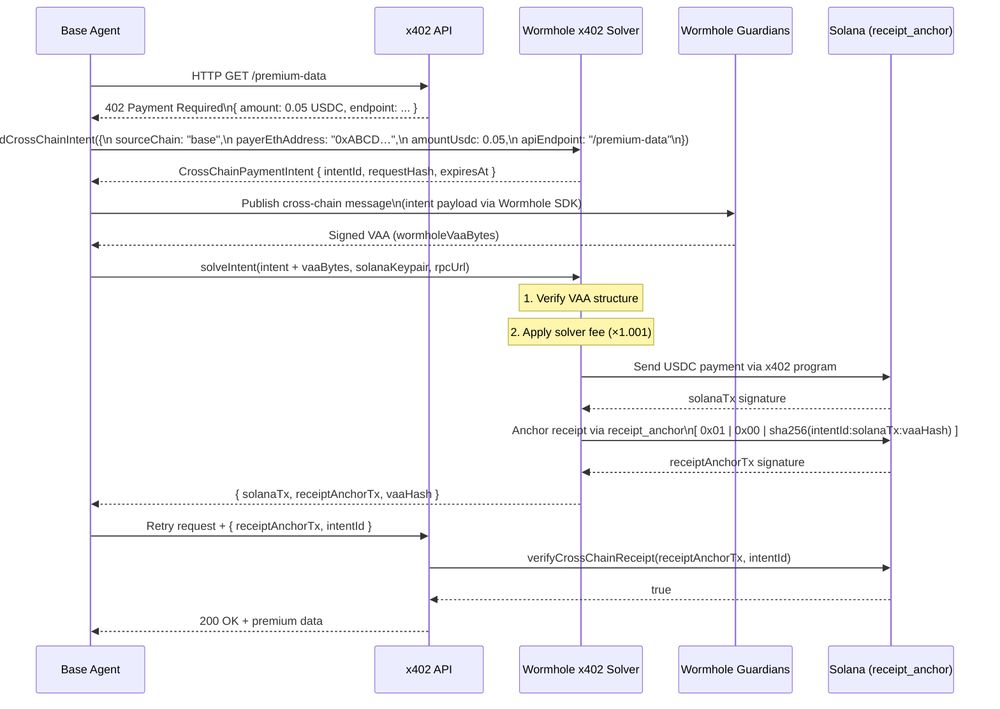

# Wormhole x402 Solver

**TDL #16** — Base agents pay via x402, Solana is the canonical receipt ledger.
VAA proofs already exist; no new infrastructure needed.

## Overview

An agent running on Base (or Ethereum / Arbitrum) calls an API that returns HTTP
402 Payment Required. Instead of paying with an EVM wallet, the agent hands the
payment intent to the Wormhole x402 Solver. The solver bridges the intent to
Solana, pays in USDC, and anchors the receipt permanently via `receipt_anchor`.

NULL stakers back the solver float so the API gets instant settlement before the
Wormhole VAA fully finalises on the source chain. The solver earns a 0.1% spread
(`SOLVER_FEE_BPS = 10`).

---

## Flow



---

## Package

`@parad0x_labs/wormhole-x402` — `packages/wormhole-x402/`

### Exported API

| Symbol | Kind | Description |
|---|---|---|
| `CrossChainPaymentIntent` | interface | Full intent object including VAA bytes slot |
| `buildCrossChainIntent(params)` | function | Creates a payment intent; derives `requestHash` and `intentId` |
| `solveIntent(intent, keypair, rpcUrl)` | async function | Verifies VAA, pays on Solana, anchors receipt |
| `verifyCrossChainReceipt(tx, intentId, rpcUrl)` | async function | Confirms receipt is on-chain and matches intent |
| `grossAmount(amountUsdc)` | function | Net → gross USDC after solver fee |
| `isIntentValid(intent)` | function | Checks expiry and VAA presence |
| `SOLVER_FEE_BPS` | const | `10` (0.1% spread) |
| `RECEIPT_ANCHOR_PROGRAM_ID` | const | Solana receipt_anchor program address |
| `WORMHOLE_CORE_BRIDGE_SOLANA` | const | Wormhole Core Bridge on Solana mainnet |

---

## Intent Fields

| Field | Type | Description |
|---|---|---|
| `intentId` | `string` | `sha256(requestHash + sourceChain + amountUsdc)` |
| `sourceChain` | `"base" \| "ethereum" \| "arbitrum"` | Origin EVM chain |
| `targetChain` | `"solana"` | Always Solana — canonical receipt ledger |
| `payerEthAddress` | `string` | `0x`-prefixed EVM address |
| `amountUsdc` | `number` | Net USDC (human units) |
| `apiEndpoint` | `string` | URL that returned 402 |
| `requestHash` | `string` | `sha256(apiEndpoint + timestamp + payerEthAddress)` |
| `expiresAt` | `number` | Unix ms expiry (default TTL: 5 minutes) |
| `wormholeVaaBytes` | `string?` | Base-64 VAA; populated by Wormhole relayer |

---

## Fee Model

```
gross = amountUsdc × (1 + 10/10_000)
      = amountUsdc × 1.001
```

- The API receives exactly `amountUsdc` in USDC on Solana.
- The solver retains `amountUsdc × 0.001` as spread.
- NULL stakers provide the float so settlement is instant.
- The solver settles with stakers once the Wormhole VAA finalises on the source chain.

---

## Receipt Anchoring

Receipt hash layout written to `receipt_anchor`:

```
[ 0x01 | 0x00 | sha256(intentId + ":" + solanaTx + ":" + vaaHash) ]
  ^^^^    ^^^^   ^^^^^^^^^^^^^^^^^^^^^^^^^^^^^^^^^^^^^^^^^^^^^^^^^
  disc   pad    32-byte receipt hash (hex → bytes)
```

This is the same 34-byte instruction data layout used by `receipt-dag` and
`liquefy-receipts`, keeping the receipt ledger unified across all DNA x402 packages.

---

## Why No New Infrastructure

Wormhole VAAs are already produced for every cross-chain message. The solver
simply:

1. Reads the VAA bytes from the Wormhole Guardian network (existing REST API).
2. Submits a standard Solana transaction referencing the VAA.
3. Writes a 34-byte memo to `receipt_anchor` (existing program, same as used
   by all other DNA x402 packages).

No new programs. No new relayer. The solver is a pure TypeScript function.

---

## Integration Example

```typescript
import {
  buildCrossChainIntent,
  solveIntent,
  verifyCrossChainReceipt,
} from "@parad0x_labs/wormhole-x402";
import { Keypair } from "@solana/web3.js";

// 1. Agent receives a 402 from an API on Base
const intent = buildCrossChainIntent({
  sourceChain: "base",
  payerEthAddress: "0xAbCd1234567890abcdef1234567890ABCDEF1234",
  amountUsdc: 0.05,
  apiEndpoint: "https://api.example.com/premium-data",
});

// 2. Publish intent via Wormhole SDK (out of scope for this package)
//    intent.wormholeVaaBytes = await wormholeRelay(intent);

// 3. Solve on Solana
const solanaKeypair = Keypair.fromSecretKey(/* ... */);
const { solanaTx, receiptAnchorTx, vaaHash } = await solveIntent(
  intent,
  solanaKeypair,
  "https://api.mainnet-beta.solana.com"
);

// 4. Verify the receipt
const ok = await verifyCrossChainReceipt(
  receiptAnchorTx,
  intent.intentId,
  "https://api.mainnet-beta.solana.com"
);
console.log("Receipt verified:", ok);
```

---

## Related Packages

| Package | Role |
|---|---|
| `@parad0x_labs/receipt-dag` | Anti-equivocation DAG; same `receipt_anchor` program |
| `@parad0x_labs/liquefy-receipts` | Monetises receipts as SPL tokens |
| `@parad0x_labs/blind-access` | ZK-gated API access (complements x402 payment gating) |
| `@parad0x_labs/context-capsule` | Encrypted agent context; anchored to same receipt chain |
