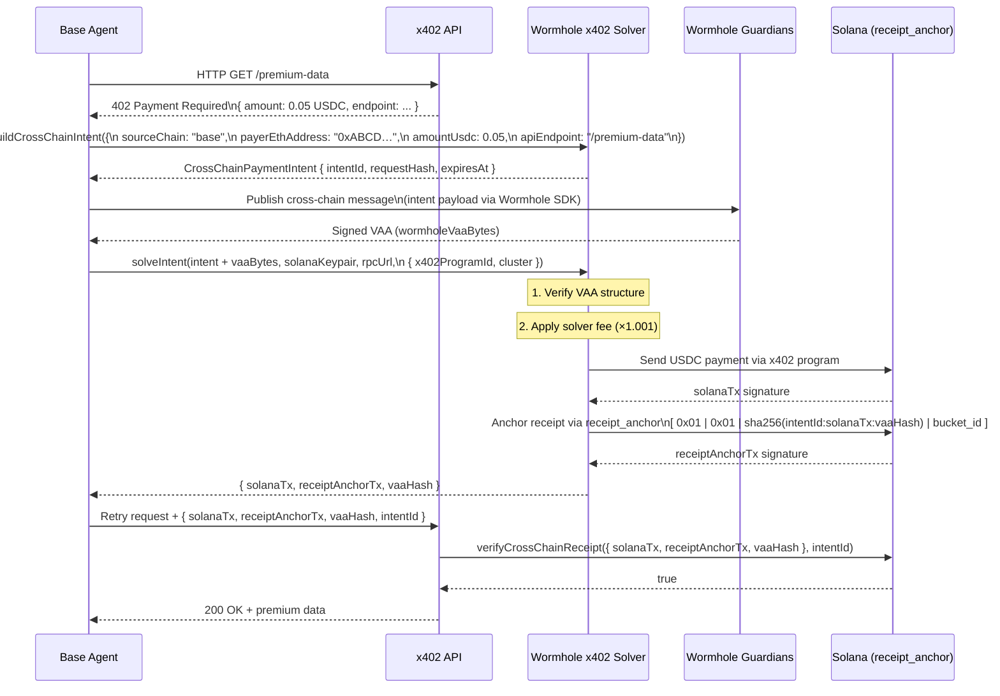

# Wormhole x402 Solver

**TDL #16** — Base agents pay via x402, Solana is the canonical receipt ledger.
VAA proofs already exist; no new infrastructure needed.

## Overview

An agent running on Base (or Ethereum / Arbitrum) calls an API that returns HTTP
402 Payment Required. Instead of paying with an EVM wallet, the agent hands the
payment intent to the Wormhole x402 Solver. The solver bridges the intent to
Solana, pays in USDC, and anchors the receipt via a `receipt_anchor` deployment
the caller names (`anchorProgramId`).

NULL stakers back the solver float so the API gets instant settlement before the
Wormhole VAA fully finalises on the source chain. The solver earns a 0.1% spread
(`SOLVER_FEE_BPS = 10`).

---

## Flow


```mermaid
sequenceDiagram
    participant Agent as Base Agent
    participant API as x402 API
    participant Solver as Wormhole x402 Solver
    participant Wormhole as Wormhole Guardians
    participant Solana as Solana (receipt_anchor)

    Agent->>API: HTTP GET /premium-data
    API-->>Agent: 402 Payment Required\n{ amount: 0.05 USDC, endpoint: ... }

    Agent->>Solver: buildCrossChainIntent({\n  sourceChain: "base",\n  payerEthAddress: "0xABCD…",\n  amountUsdc: 0.05,\n  apiEndpoint: "/premium-data"\n})
    Solver-->>Agent: CrossChainPaymentIntent { intentId, requestHash, expiresAt }

    Agent->>Wormhole: Publish cross-chain message\n(intent payload via Wormhole SDK)
    Wormhole-->>Agent: Signed VAA (wormholeVaaBytes)

    Agent->>Solver: solveIntent(intent + vaaBytes, solanaKeypair, rpcUrl,\n  { x402ProgramId, cluster })

    Note over Solver: 1. Verify VAA structure
    Note over Solver: 2. Apply solver fee (×1.001)
    Solver->>Solana: Send USDC payment via x402 program
    Solana-->>Solver: solanaTx signature

    Solver->>Solana: Anchor receipt via receipt_anchor\n[ 0x01 | 0x01 | sha256(intentId:solanaTx:vaaHash) | bucket_id ]
    Solana-->>Solver: receiptAnchorTx signature

    Solver-->>Agent: { solanaTx, receiptAnchorTx, vaaHash }

    Agent->>API: Retry request + { solanaTx, receiptAnchorTx, vaaHash, intentId }
    API->>Solana: verifyCrossChainReceipt({ solanaTx, receiptAnchorTx, vaaHash }, intentId)
    Solana-->>API: true
    API-->>Agent: 200 OK + premium data
```

---

## Package

`@parad0x_labs/wormhole-x402` — `packages/wormhole-x402/`

### Exported API

| Symbol | Kind | Description |
|---|---|---|
| `CrossChainPaymentIntent` | interface | Full intent object including VAA bytes slot |
| `buildCrossChainIntent(params)` | function | Creates a payment intent; derives `requestHash` and `intentId` |
| `solveIntent(intent, keypair, rpc, { x402ProgramId, cluster?, anchorProgramId? })` | async function | Verifies VAA, pays via the named x402 program, anchors receipt |
| `verifyCrossChainReceipt(receipt, intentId, rpc, { cluster?, anchorProgramId? })` | async function | Confirms the anchor instruction targets receipt_anchor and carries the expected receipt hash |
| `verifyReceiptAnchorTransaction(tx, { anchorProgramId, expectedAnchor })` | async function | Same check on an already-fetched transaction |
| `buildReceiptAnchorInstruction(params)` | async function | receipt_anchor AnchorSingle instruction with bucket PDA accounts |
| `computeReceiptHash(intentId, solanaTx, vaaHash)` | function | 32-byte receipt hash anchored on-chain |
| `resolveReceiptAnchorProgramId({ cluster?, anchorProgramId? })` | function | Explicit ID, else cluster → configured receipt_anchor program; throws `RECEIPT_ANCHOR_UNAVAILABLE` for a cluster with none configured (mainnet-beta) |
| `grossAmount(amountUsdc)` | function | Net → gross USDC after solver fee |
| `isIntentValid(intent)` | function | Checks expiry and VAA presence |
| `SOLVER_FEE_BPS` | const | `10` (0.1% spread) |
| `RECEIPT_ANCHOR_PROGRAM_IDS` | const | Configured receipt_anchor per cluster: devnet `HSdEQWunzPtNqdzv5HfXuA3zwPLpgTXRyfbndnGamhXs` (2026-10-06); no mainnet-beta entry |
| `RECEIPT_ANCHOR_PROGRAM_ID` | const | receipt_anchor on mainnet-beta, or `null` while none is configured |
| `RECEIPT_ANCHOR_UNAVAILABLE` | const | Error message used when anchoring is requested without a usable program |
| `WORMHOLE_CORE_BRIDGE_SOLANA` | const | Wormhole Core Bridge on Solana mainnet |

---

## Intent Fields

| Field | Type | Description |
|---|---|---|
| `intentId` | `string` | `sha256(requestHash + sourceChain + amountUsdc)` |
| `sourceChain` | `"base" \| "ethereum" \| "arbitrum"` | Origin EVM chain |
| `targetChain` | `"solana"` | Always Solana — canonical receipt ledger |
| `payerEthAddress` | `string` | `0x`-prefixed EVM address |
| `amountUsdc` | `number` | Net USDC (human units) |
| `apiEndpoint` | `string` | URL that returned 402 |
| `requestHash` | `string` | `sha256(apiEndpoint + timestamp + payerEthAddress)` |
| `expiresAt` | `number` | Unix ms expiry (default TTL: 5 minutes) |
| `wormholeVaaBytes` | `string?` | Base-64 VAA; populated by Wormhole relayer |

---

## Fee Model

```
gross = amountUsdc × (1 + 10/10_000)
      = amountUsdc × 1.001
```

- The API receives exactly `amountUsdc` in USDC on Solana.
- The solver retains `amountUsdc × 0.001` as spread.
- NULL stakers provide the float so settlement is instant.
- The solver settles with stakers once the Wormhole VAA finalises on the source chain.

---

## Receipt Anchoring

Instruction data written to `receipt_anchor` (AnchorSingle, explicit bucket, 42 bytes):

```
[ 0x01 | 0x01 | sha256(intentId + ":" + solanaTx + ":" + vaaHash) | bucket_id ]
  ^^^^    ^^^^   ^^^^^^^^^^^^^^^^^^^^^^^^^^^^^^^^^^^^^^^^^^^^^^^^^   ^^^^^^^^^
  ver    flags  32-byte receipt hash                                u64 LE
```

Accounts: `[payer (signer, writable), bucket PDA ["bucket", bucket_id_le8] (writable), system_program]`.
`bucket_id = floor(unix_seconds / 3600)`. This is the same wire form `receipt-dag` uses,
keeping the receipt ledger unified across DNA x402 packages.

### Program IDs

`RECEIPT_ANCHOR_PROGRAM_IDS` names the devnet receipt_anchor `HSdEQWunzPtNqdzv5HfXuA3zwPLpgTXRyfbndnGamhXs` (2026-10-06,
equal to `programs.receiptAnchor` in [`configs/devnet.oss.json`](../configs/devnet.oss.json)). Mainnet-beta has
none: the earlier mainnet deployment is retired, so there `solveIntent` and `verifyCrossChainReceipt` throw
`RECEIPT_ANCHOR_UNAVAILABLE` unless the caller passes `anchorProgramId` (for example a
receipt_anchor deployment on a local validator). `solveIntent` checks this before sending the
payment, so no payment is made without a usable anchor. The x402 payment
program is not part of the cluster configs, so `solveIntent` requires the caller to pass
`x402ProgramId`; it throws before sending anything if the ID is missing or malformed.

### Verification

`verifyCrossChainReceipt` fetches the anchor transaction and accepts it only when it
succeeded and a top-level instruction:

1. targets the configured receipt_anchor program (as the invoked program, not just a listed account);
2. carries v1 AnchorSingle data whose 32-byte anchor equals `sha256(intentId:solanaTx:vaaHash)`;
3. for the explicit-bucket form, passes the bucket PDA derived from the encoded `bucket_id`.

---

## Why No New Infrastructure

Wormhole VAAs are already produced for every cross-chain message. The solver
simply:

1. Reads the VAA bytes from the Wormhole Guardian network (existing REST API).
2. Submits a standard Solana transaction referencing the VAA.
3. Anchors a 42-byte AnchorSingle instruction to the `receipt_anchor` program the caller
   names (same wire form as other DNA x402 packages).

No new programs. No new relayer. The solver is a pure TypeScript function.

---

## Integration Example

```typescript
import {
  buildCrossChainIntent,
  solveIntent,
  verifyCrossChainReceipt,
} from "@parad0x_labs/wormhole-x402";
import { Keypair } from "@solana/web3.js";

// 1. Agent receives a 402 from an API on Base
const intent = buildCrossChainIntent({
  sourceChain: "base",
  payerEthAddress: "0xAbCd1234567890abcdef1234567890ABCDEF1234",
  amountUsdc: 0.05,
  apiEndpoint: "https://api.example.com/premium-data",
});

// 2. Publish intent via Wormhole SDK (out of scope for this package)
//    intent.wormholeVaaBytes = await wormholeRelay(intent);

// 3. Solve on Solana
const solanaKeypair = Keypair.fromSecretKey(/* ... */);
const receipt = await solveIntent(
  intent,
  solanaKeypair,
  "https://solana-rpc.publicnode.com",
  { x402ProgramId: "<your x402 payment program>", anchorProgramId: "<your receipt_anchor program>" }
);

// 4. Verify the receipt
const ok = await verifyCrossChainReceipt(
  receipt,
  intent.intentId,
  "https://solana-rpc.publicnode.com",
  { anchorProgramId: "<your receipt_anchor program>" }
);
console.log("Receipt verified:", ok);
```

---

## Related Packages

| Package | Role |
|---|---|
| `@parad0x_labs/receipt-dag` | Anti-equivocation DAG; same `receipt_anchor` program |
| `@parad0x_labs/liquefy-receipts` | Compresses, nets, encrypts and Merkle-commits receipt batches and builds `receipt_anchor` instruction bytes; it mints no tokens and sends no transactions |
| `@parad0x_labs/blind-access` | ZK-gated API access (complements x402 payment gating) |
| `@parad0x_labs/context-capsule` | Compressed (zlib, not encrypted) agent session history with a Merkle root; correction chains can be posted as an SPL Memo, separate from `receipt_anchor` |
